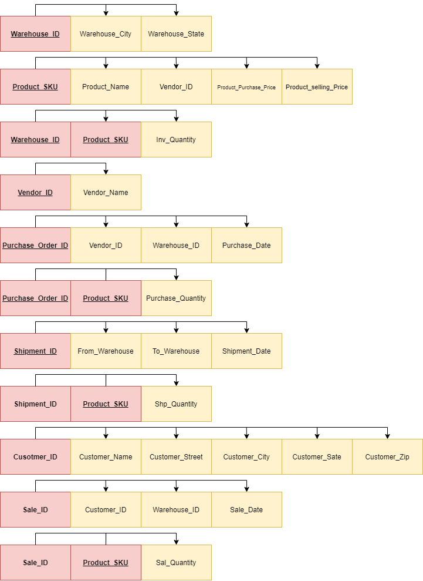

# Inventory Management System

1. Project Identification:
  1. This project introduces an inventory management system for an e-commerce electronics store.
  2. The database introduced in this project can be extremely useful for the inventory control team for the store.
  3. The database introduced in this project keeps track of the inventory of each warehouse for this store, the inbound coming to every warehouse, whether coming from external vendors through purchase orders or shipped from other warehouses, and the outbound of every warehouse through customer purchases.
  4. The database introduced in this project can be used to answer any question you want to know about the quantity of products in a warehouse, purchase order, shipment or sale. The database is composed of products, warehouses, vendors and customers, which the inventory moves between those entities through purchase orders, shipments and sales.

1. Project Analysis
  1. In an inventory management environment, the goal is to track quantities and movement of products as a variable in time. We think of the warehouses as the center of our system with the inventory stored into it, and we track everything coming the warehouse, inbound, and everything leaving the warehouse as outbound.
  2. To track the inventory in the warehouse we need our data base to answer three questions: what are the products available with what quantities and in which warehouse?

The inbound to a warehouse happens in two forms whether through a purchase order from a vendor or through a shipment from another warehouse.

The outbound from a warehouse happens through sales to customers.

  1. The inventory control team in each warehouse under the leadership of a central inventory control management are the people who deals with.
  2. The inbound and outbound operation happens every day and every second in the warehouse. The inventory is always changing.
  3. The main purpose of an inventory management system is to keep track of all the movement of the products, the inventory on hand and the &quot;shrink,&quot; which is the amount of lost inventory in dollar value.
  4. For the sake of simplification, the database introduced in this project lacks the ability to track shrink. However, it is worth mentioning that through my experience in Best Buy we used to track the shrink by utilizing two separate databases. This data base also doesn&#39;t keep track of any of the employees involved in the process, a feature that is required for tracking inbound and outbound activities in any warehouse.
1. Project Design:
  1. ERD

  1. Dependency diagrams

